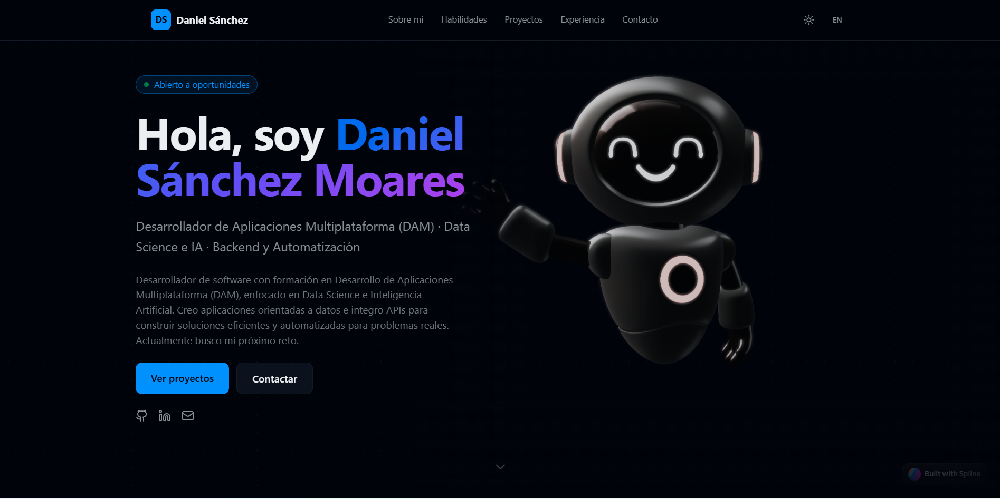
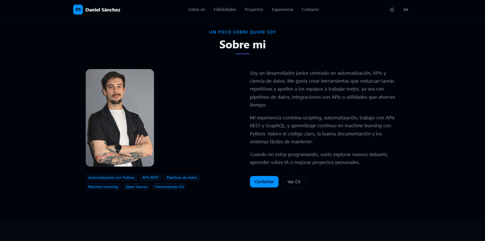
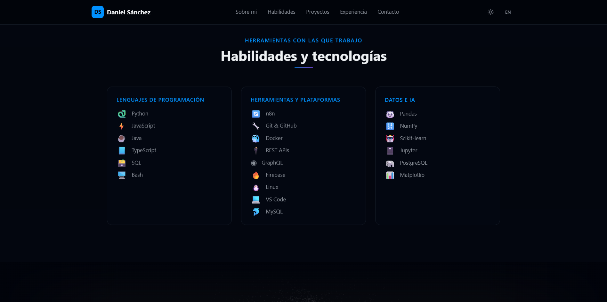
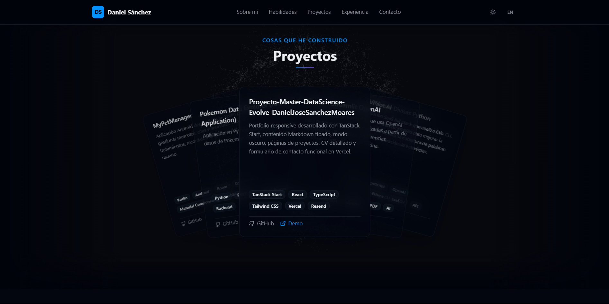
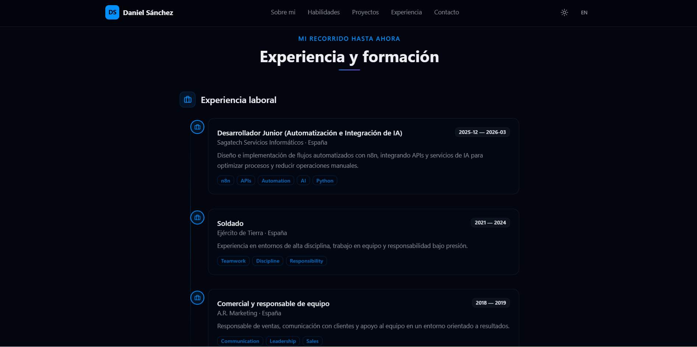
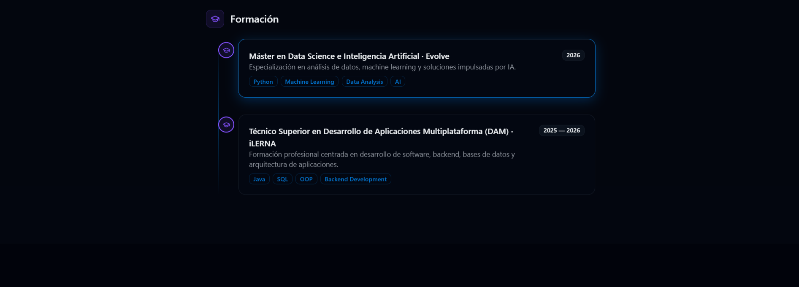
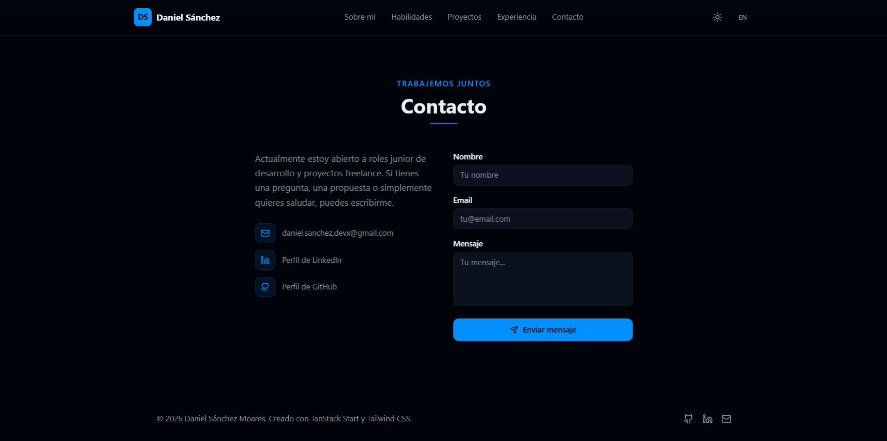

# Proyecto-Master-DataScience-Evolve-DanielJoseSanchezMoares

Portfolio profesional desarrollado como proyecto academico del Master en Data Science de Evolve.

Este proyecto centraliza mi perfil como desarrollador, mi experiencia, mi formacion y una seleccion de proyectos tecnicos enfocados en automatizacion, backend, Python, Data Science e Inteligencia Artificial. El objetivo es ofrecer una presencia profesional clara, visual y navegable, tanto para recruiters como para equipos tecnicos.

## Demo

- Web en produccion: [danisanchezdev.vercel.app](https://danisanchezdev.vercel.app)
- Repositorio: [Proyecto-Master-DataScience-Evolve-DanielJoseSanchezMoares](https://github.com/DaniSanchezDevx/Proyecto-Master-DataScience-Evolve-DanielJoseSanchezMoares)

## Capturas del proyecto

### Hero principal



### Sobre mi



### Habilidades y tecnologias



### Proyectos



### Experiencia



### Formacion



### Contacto



## Objetivo del proyecto

El portfolio ha sido disenado para:

- presentar de forma profesional mi perfil tecnico
- reunir en un unico lugar mis proyectos mas relevantes
- mostrar experiencia real con despliegue web y desarrollo frontend
- facilitar el contacto directo mediante formulario funcional
- servir como escaparate publico de mis capacidades tecnicas

## Funcionalidades principales

- Diseno responsive adaptado a movil, tablet y escritorio
- Modo oscuro y modo claro
- Cambio de idioma entre espanol e ingles
- Hero principal con integracion visual 3D
- Secciones de sobre mi, habilidades, proyectos, experiencia y contacto
- Tarjetas de proyectos interactivas tipo deck
- Click en la tarjeta principal para abrir el repositorio en GitHub
- Click en tarjetas laterales para llevarlas al frente
- Paginas adicionales para resume, proyectos y contacto
- Formulario de contacto operativo mediante API y Resend
- Contenido gestionado con archivos Markdown tipados

## Stack tecnologico

### Frontend

- React 19
- TanStack Start
- TanStack Router
- Vite 7
- Tailwind CSS 4
- Radix UI
- Lucide React

### Contenido y tipado

- Content Collections
- Zod
- Markdown

### Backend y servicios

- API route en TanStack Start
- Resend para envio de emails
- Variables de entorno en Vercel

### Despliegue

- Vercel

## Estructura del proyecto

```text
content/
  blog/                Articulos en Markdown
  education/           Formacion academica
  jobs/                Experiencia profesional
  projects/            Proyectos del portfolio

public/
  daniel.jpg           Foto de perfil
  favicon.ico

src/
  components/          Componentes reutilizables y UI
  lib/                 Utilidades, i18n y helpers
  routes/
    __root.tsx         Layout principal
    index.tsx          Home del portfolio
    resume.tsx         Pagina de resume
    projects.tsx       Pagina de proyectos
    contact.tsx        Pagina de contacto
    api/contact.ts     Endpoint del formulario
  styles.css           Estilos globales

content-collections.ts Configuracion de colecciones
vercel.json            Configuracion de build en Vercel
package.json           Dependencias y scripts
```

## Proyectos destacados incluidos

- CVPilot AI
- Pokemon App
- MyPetManager
- RecetAI Streamlit OpenAI
- Conversor Divisas Python

## Como ejecutar el proyecto en local

### 1. Clonar el repositorio

```bash
git clone https://github.com/DaniSanchezDevx/Proyecto-Master-DataScience-Evolve-DanielJoseSanchezMoares.git
cd Proyecto-Master-DataScience-Evolve-DanielJoseSanchezMoares
```

### 2. Instalar dependencias

```bash
npm install
```

### 3. Configurar variables de entorno

Crea un archivo `.env.local` con estas variables:

```env
RESEND_API_KEY=tu_api_key
CONTACT_TO_EMAIL=tu_correo@ejemplo.com
CONTACT_FROM_EMAIL=Portfolio <onboarding@resend.dev>
```

## 4. Ejecutar en desarrollo

```bash
npm run dev
```

## 5. Generar build de produccion

```bash
npm run build
```

## Formulario de contacto

El formulario de contacto envia mensajes mediante una ruta API propia:

- endpoint: `/api/contact`
- servicio de email: Resend
- validaciones de nombre, email y mensaje
- proteccion basica con honeypot

Para que funcione correctamente en produccion, el proyecto necesita las variables de entorno configuradas en Vercel.

## Decisiones tecnicas destacadas

- Uso de Content Collections para separar contenido y presentacion
- Enfoque tipado para proyectos, experiencia y educacion
- Arquitectura simple de mantener y escalar
- Navegacion de una sola pagina con rutas adicionales para mejorar accesibilidad y estructura
- Integracion visual orientada a marca personal y presentacion profesional

## Resultados del proyecto

Con este portfolio he construido una aplicacion real desplegada en produccion que:

- representa mi perfil profesional de forma publica
- agrupa mis proyectos tecnicos mas importantes
- permite contacto funcional desde la propia web
- muestra competencias en frontend, integracion de APIs, despliegue y experiencia de usuario

## Proximos pasos

- anadir mas proyectos y articulos tecnicos
- ampliar capturas o demos individuales por proyecto
- mejorar SEO tecnico y metadatos sociales
- seguir refinando animaciones e integraciones visuales

## Autor

Daniel Sanchez Moares  
Desarrollador de Aplicaciones Multiplataforma orientado a Data Science, IA, backend y automatizacion.

- Portfolio: [danisanchezdev.vercel.app](https://danisanchezdev.vercel.app)
- GitHub: [DaniSanchezDevx](https://github.com/DaniSanchezDevx)
- LinkedIn: [Daniel Sanchez](https://www.linkedin.com/in/daniel-sanchez-moares/)

---

Proyecto academico desarrollado durante el Master en Data Science de Evolve.
